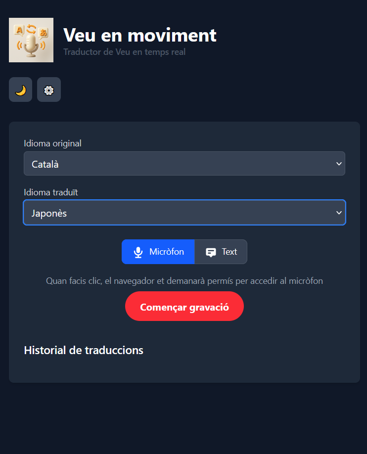
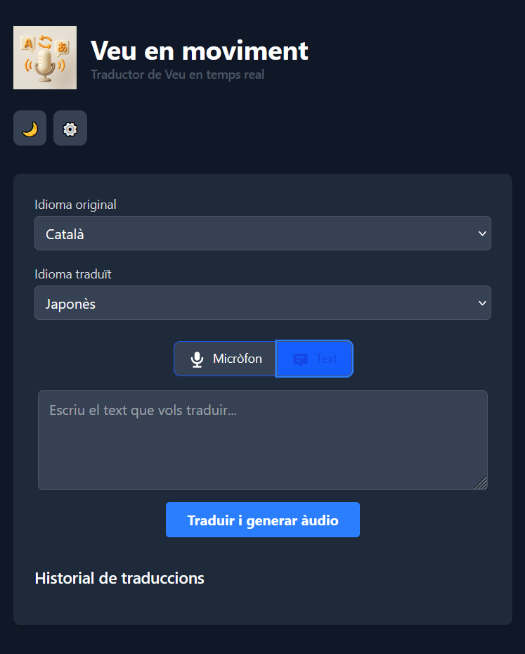

# Veu en Moviment - Traductor de Veu en Temps Real


## 📝 Descripció

**Veu en Moviment** és una aplicació web que permet traduir veu en temps real entre múltiples idiomes. L'aplicació utilitza les APIs d'OpenAI (Whisper, GPT i TTS) per transcriure, traduir i generar àudio de manera eficient i precisa.

L'aplicació funciona completament al navegador, sense necessitat d'instal·lar-la, i totes les dades es processen localment a excepció de les interaccions amb l'API d'OpenAI.

## ✨ Característiques

- **Traducció de veu en temps real**: Grava la teva veu i tradueix-la a l'idioma que prefereixis.
- **Entrada directa de text**: Pots introduir text directament per traduir-lo sense necessitat d'utilitzar el micròfon.
- **Múltiples idiomes**: Suport per a català, castellà, anglès, francès, alemany, italià, portuguès, holandès, rus, japonès i xinès.
- **Personalització de veus**: Escull entre diferents veus masculines i femenines per als àudios generats.
- **Temporitzador de gravació**: Visualitza el temps que portes parlant durant la gravació.
- **Mode fosc/clar**: Interfície adaptable a les teves preferències visuals.
- **Historial de traduccions**: Accedeix fàcilment a les teves traduccions anteriors.
- **Descàrrega d'àudios**: Descarrega tant l'àudio original com el traduït per utilitzar-los fora de l'aplicació.
- **Client autònom**: No es requereix servidor; tota la lògica s'executa al navegador.
- **Disseny responsiu**: Funciona perfectament tant en dispositius mòbils com en ordinadors.

## 🚀 Demo

Pots provar l'aplicació a: [Veuenmoviment](https://qmrcat.github.io/VeuEnMoviment/)

## 📷 Captures de pantalla

 *(Exemple - Substitueix amb captures reals)*

 *(Exemple - Substitueix amb captures reals)*

## 🔧 Tecnologies utilitzades

- **HTML5**: Estructura de l'aplicació.
- **CSS3 amb Tailwind CSS**: Estil i disseny responsiu.
- **JavaScript ES6**: Lògica de l'aplicació amb classes modulars.
- **AlpineJS**: Interactivitat i gestió d'estat mínim.
- **APIs d'OpenAI**:
  - **Whisper API**: Transcripció d'àudio a text.
  - **GPT API**: Traducció de text entre idiomes.
  - **TTS API**: Conversió de text a veu natural.
- **Web Audio API**: Captura i processament d'àudio.
- **LocalStorage**: Emmagatzematge de configuracions i preferències.

## 🛠️ Instal·lació i ús

### Per a usuaris

1. Visita [URL de l'aplicació] (Afegeix la URL quan estigui disponible)
2. Configura la teva clau API d'OpenAI fent clic al botó ⚙️
3. Selecciona l'idioma original i l'idioma de traducció
4. Utilitza el micròfon per gravar la teva veu o escriu directament el text
5. Escolta la traducció i visualitza els textos

### Per a desenvolupadors

1. Clona aquest repositori:
   ```bash
   git clone https://github.com/username/veu-en-moviment.git
   cd veu-en-moviment
   ```

2. Obre `index.html` en el teu navegador preferit.

3. Per a desenvolupament amb Tailwind:
   ```bash
   # Instal·la les dependències
   npm install
   
   # Executa Tailwind en mode desenvolupament
   npm run dev
   ```

## 🔑 Configuració d'API

L'aplicació requereix una clau API d'OpenAI per funcionar. Pots obtenir-ne una a [https://platform.openai.com/account/api-keys](https://platform.openai.com/account/api-keys).

⚠️ **Important**: La teva clau API es guarda només localment al teu navegador i mai s'envia al nostre servidor.

## 🤝 Contribucions

Les contribucions són benvingudes! Si vols millorar aquesta aplicació, segueix aquests passos:

1. Fes un fork del projecte
2. Crea una branca per a la teva millora (`git checkout -b feature/amazing-feature`)
3. Fes commit dels teus canvis (`git commit -m 'Add some amazing feature'`)
4. Fes push a la branca (`git push origin feature/amazing-feature`)
5. Obre una Pull Request

## 📜 Llicència

Aquest projecte està sota la llicència MIT. Consulta el fitxer `LICENSE` per a més detalls.

## 🙏 Agraïments

- OpenAI per proporcionar les APIs de processament de llenguatge natural i veu.
- Tailwind CSS per l'excel·lent framework CSS.
- AlpineJS per la senzilla interactivitat.
- Tots els col·laboradors i beta-testers que han fet possible aquesta aplicació.

## 📬 Contacte

QMRCAT

URL del projecte: [https://github.com/qmrcat/VeuEnMoviment](https://github.com/qmrcat/VeuEnMoviment)